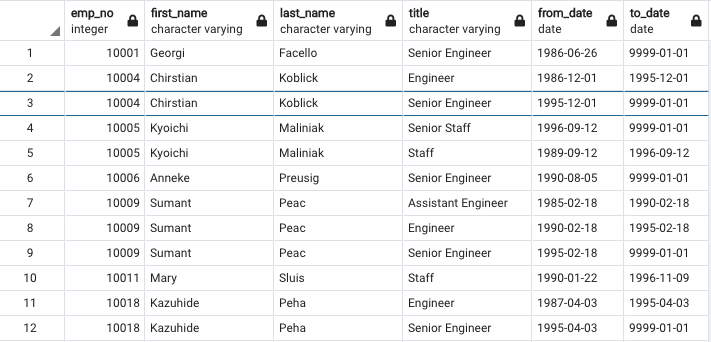
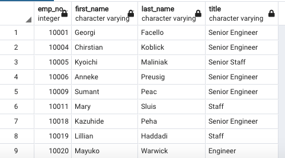
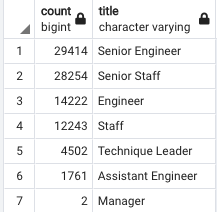
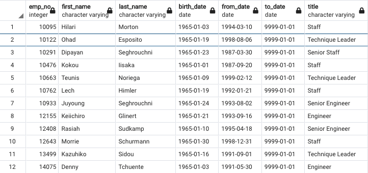

# Pewlett-Hackard-Analysis

## Overview

The purpose of this assignment was to determine the number of retiring employees per title in Pewlett Hackard. As well as, locate which employees qualify to join a mentorship program.

Using SQL, we created a Retirement Titles table that shows all the current employees who were born between 1952 to 1955. Using the Distinct On function, we were able to filter the table and show the most current title for each employee. Then, the Count On function was use to create a table that showed the amount of retirement-age employees by most recent job title.

The second part of this project consisted of creating a Mentorship Eiligibility table, specifically for employees who were born on the year 1965.

## Results

### Retirement Titles Table:

* The table shows every employee eligible for retirement, the title or titles they aquired in the company, and how long they've had the title for.
* Some names are shown more than once because those employees had been promoted throughout their time in Pewlett Hackard.

### Unique Titles Table:

* This table is a modified version of the retirement titles table, it only shows the employees once with their latest title in the company.
* The Disticnt On fucntion was used to narrow down to one title per employee.

### Retiring Titles

* This table shows the amount of retirement-age employees in each title.
* The vast majority of retirement-age employees have a senior title within the company.

### Mentorship Eligibility

* Employees who were born in 1965 are eligible for the mentorship program.
* 1,549 of the Pewlett Hackard Employees qualify.
* The majority of the eligible employees have a "Senior Staff" title.
* The minority of the eligible employees have an "Assistant Engineer" title.

## Summary
